# 스프링 입문을 위한 자바 객체 지향의 원리와 이해

<p align="center"></p> 

[스프링 입문을 위한 자바 객체 지향의 원리와 이해](http://www.yes24.com/Product/Goods/17350624)를 바탕으로 정리한 자료입니다.
</br>

## 목차
1. [AOP](#AOP)
2. [IoC/DI](#ioc/di)

</br>
</br>


# AOP

스프링의 3대 프로그래밍 모델 중 두 번째는 AOP이다.

AOP는 Aspect - Oriented Programming의 약자이고, 번역하면 관점 지향 프로그래밍이다. (관심사)

* 특징
  * AOP는 인터페이스 기반이다.
  * AOP는 프록시패턴(데코레이터)를 이용한다.
  * AOP는 런타임 기반이다.


## 1. AOP란?


### 1-1. AOP 개념

* AOP란?
  * 스프링 DI가 의존성(new)에 대한 주입이라면 AOP는 로직(code)주입이라고 할 수 있다.
  * 관점 지향 프로그래밍을 뜻하는데 관점 지향은 쉽게 말해 ***어떤 로직을 기준으로 핵심적인 관점, 부가적인 관점으로 나누어서 보고 그 관점을 기준으로 각각 모듈화하겠다는 것이다***
    * 핵심적인 관점 : 비즈니스 로직 (INSERT, SELECT등등)
    * 부가적인 관점 : 핵심 로직을 실행하기 위해서 행해지는 로직 (DB연결, 로깅, 파일 입출력 등)
* 예시
  * 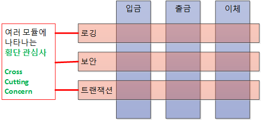
  * 입금, 출금, 이체 모듈에서 로깅, 보안, 트랜잭션 기능이 반복적으로 나타나는 것을 볼 수 있다.
  * 다수의 모듈에 공통적으로 나타나는 부분이 존재하는데, 바로 이것을 횡단 관심사(부가적인 관점)이라 한다.
  * 대표적인 예시가 JDBC이다.
* `코드 = 핵심 관심사(핵심적인 관점) + 횡단 관심사(부가적인 관점)`

* 예시

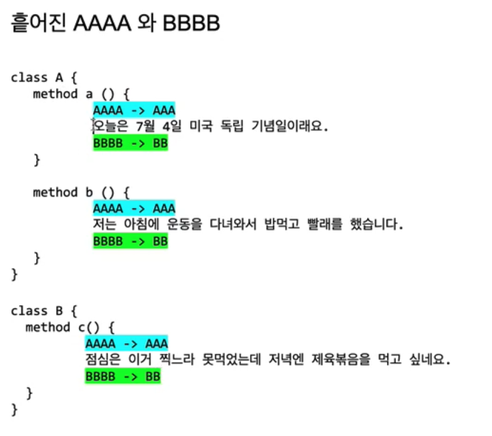

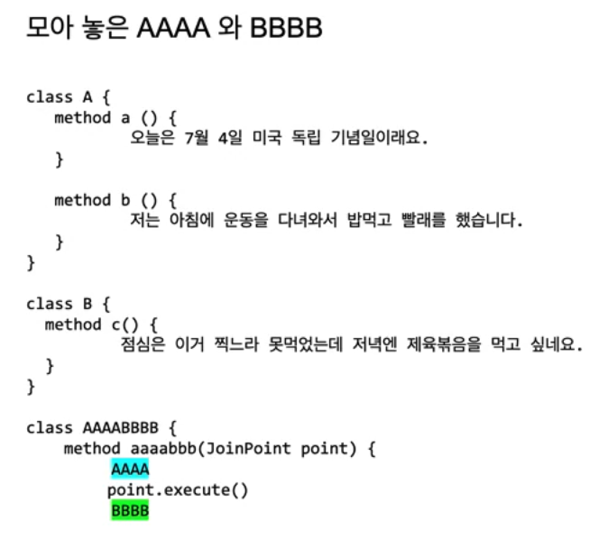

( 출처 : 백기선님 강의 )


### 1-2. 메서드에 로직을 주입할 수 있는 곳

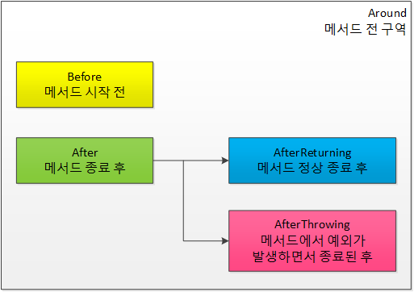

* 개념
  * ***스프링 DI가 의존성에 대한 주입이라면 스프링 AOP는 로직 주입이라고 볼 수 있다.***
  * 객체지향에서 로직이 있는 곳은 당연히 메서드이다.
* 메서드에서 코드를 주입할 수 있는 곳
  * Around : Advice가 타겟 메서드를 감싸서 타겟 메서드 호출전과 후에 Advice기능 수행
  * Before : Advice 타겟 메서드가 호출되기 전에 Advice 기능을 수행
  * After : 타겟 메서드의 결과에 관계없이 타켓 메서드가 완료되면 Advice 기능 수행
  * AfterReturning : 정상적 반환 이후 타겟 메서드가 성공적으로 결과값을 반환 후에 Advice 기능 수행
  * AfterThrowing : 예외 발생 이후 타겟 메서드가 수행 중 예외를 던지게 되면 Advice 기능 수행


### 1-3. AOP 구현 방법

1. 컴파일 (AspectJ)
   * `A.java` ---(AOP)---> `A.class`
   * 컴파일을 한 코드에는 AOP가 적용된 것 처럼 하는 방식
2. 바이트코드 조작
   * `A.java` ------> `A.class` ---(AOP)---> 메모리
   * `A.class`에서 클래스로더를 사용해서 바이트코드를 메모리에 올릴때 AOP 적용
3. 프록시 패턴 (스프링 AOP)
   * https://refactoring.guru/design-patterns/proxy


### 1-4. AOP가 필요한 상황

* 모든 메서드의 호출 시간을 측정하고 싶다면?
* 공통 관심 사항(cross-cutting concern) vs 핵심 관심 사항 (core concern)

* 회원 가입 시간, 회원 조회 시간을 측정하고 싶다면?

> AOP를 적용하지 않은 예시

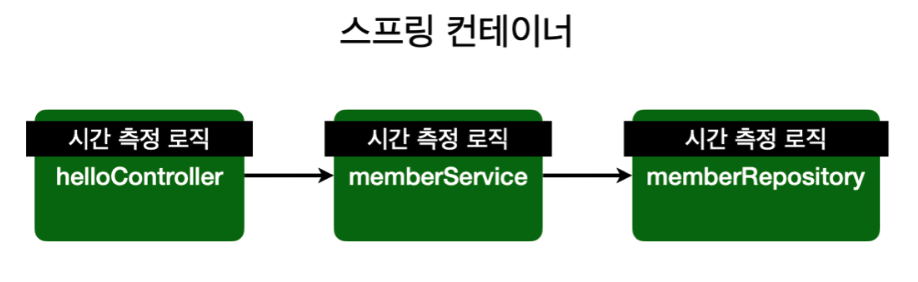

* 설명
  * **측정하고 싶은 메서드마다 시간 측정 로직을 넣어주는 것이다.**
* 문제
  * ***만약 측정하는 기준을 바꾸고 싶으면 모든 로직의 대한 코드를 바꿔줘야한다.***
  * 회원 가입, 회원 조회에 시간을 측정하는 기능은 핵심 관심 사항이 아니다.
  * 시간을 측정하는 로직은 공통 관심 사항이다.

* 의존 관계


> AOP를 적용한 예시

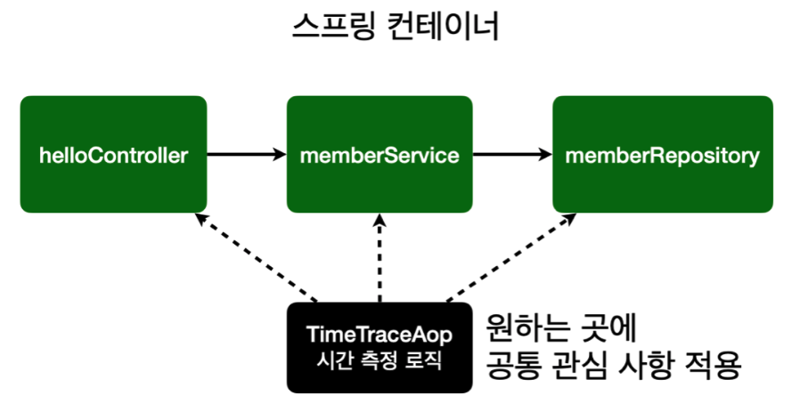

* 설명
  * 하나의 Aspect를 만들고, 시간을 측정하고 싶은 메서드에 주입해준다.
* 해결
  * ***회원 가입, 회원 조회등 핵심 관심사항과 시간을 측정하는 공통 관심 사항을 분리한다.***
  * 시간을 측정하는 로직을 별도의 공통 로직으로 만들었다.
  * 핵심 관심 사항을 깔끔하게 유지할 수 있다.
  * ***변경이 필요하면 이 로직만 변경하면 된다.***

* 의존 관계

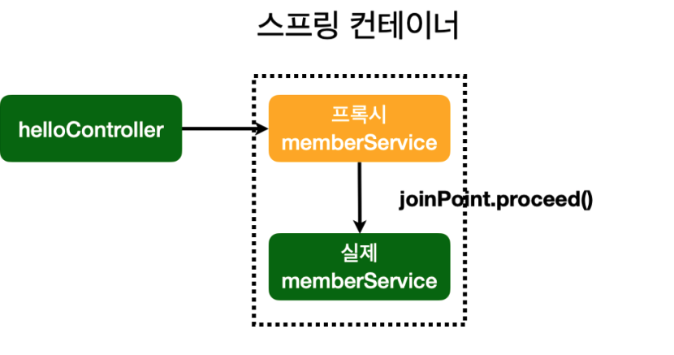

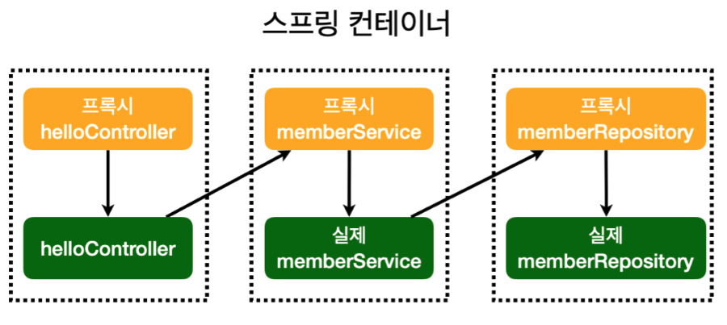

( 사진 출처 : 김영한님의 강의 )


## 2. 예시를 통한 AOP

AOP를 이해하기 위해서는 예시를 보는 것이 제일 좋은 것 같다.


### 2-1. AOP를 사용하지 않은 경우

> 남자와 여자의 삶을 프로그래밍한다고 가정해보자.

* 남자
  * 열쇠로 문을 열고 집에 들어간다.
  * __컴퓨터로 게임을 한다.__
  * 소등하고 잔다.
  * 자물쇠를 잠그고 집을 나선다.
  * 예외상황처리 : 집에 불남 - 119에 신고한다.
* 여자
  * 열쇠로 문을 열고 집에 들어간다.
  * __요리를 한다.__
  * 소등하고 잔다.
  * 자물쇠를 잠그고 집을 나선다.
  * 예외상황처리 : 집에 불남 - 119에 신고한다.

```java
// 남자
public class Boy {
  public void runSomething() {
    System.out.println("열쇠로 문을 열고 집에 들어간다.");
  
    try {
      System.out.println("컴퓨터로 게임을 한다"); // 핵심적인 관점
    } catch (Exception e){
      if(e.getMessage.equals("집에 불남")){
        System.out.println("119에 신고한다.");
      }
    } finally {
      System.out.println("소등하고 간다.");
    }

    System.out.println("자물쇠로 잠그고 집을 나선다.")
  }
}

// 여자
public class Girl {
  public void runSomething() {
    System.out.println("열쇠로 문을 열고 집에 들어간다.");
  
    try {
      System.out.println("요리를 한다."); // 핵심적인 관점
    } catch (Exception e){
      if(e.getMessage.equals("집에 불남")){
        System.out.println("119에 신고한다.");
      }
    } finally {
      System.out.println("소등하고 간다.");
    }

    System.out.println("자물쇠로 잠그고 집을 나선다.")
  }
}
```

* 해석
  * 위 코드를 보면 `Boy`와 `Girl`의 `runSomething()`로직을 보면 반복되는 코드가 엄청 많다.


### 2-2. AOP를 적용한 예제


#### 2-2-1. 예제

```xml
<?xml version="1.0" encoding="UTF-8"?>
<beans xmlns="http://www.springframework.org/schema/beans"
       xmlns:xsi="http://www.w3.org/2001/XMLSchema-instance"
       xsi:schemaLocation="http://www.springframework.org/schema/beans
                           http://www.springframework.org/schema/beans/spring-beans.xsd">
  
  <aop:aspectj-autoproxy />
  <bean id="myAspect" class="aop002.MyAspect" />
  <bean id="boy" class="aop002.Boy" />
</beans>
```

* 달라진 점
  * `myAspect`라고 하는 빈이 설정되었다.

```java
// Person.java
public interface Person {
  void runSomething();
}

// Boy.java
public class Boy implements Person {
  public void runSomething() {
    System.out.println("컴퓨터로 게임을 한다.");
  }
}

// MyAspect 
@Aspect
public class MyAspect {
  @Before("execution(public void aop002.Boy.runSomething())")
  public void before(JoinPoint joinPoint){
    System.out.println("얼굴 인식 확인 : 문을 개방하라");
    // System.out.println("열쇠로 문을 열고 집에 들어간다.");
  }
}
```

* 해석
  * AOP적용을 위해 인터페이스 기반으로 `Boy`를 변경하였다.
  * `MyAspect`가 추가되었다.
* `@Aspect`
  * 이 클래스는 이제 AOP(컨테이너)에서 사용하겠다는 의미
* `@Before`
  * 대상 메서드 실행 전에 이 메서드를 실행하겠다는 의미.
* `JoinPoint`
  * `JoinPoint`는 `@Before`에서 선언된 메서드인 `aop002.Boy.runSomething()`을 의미한다.


#### 2-2-2. 설명

> AOP 적용 전/후

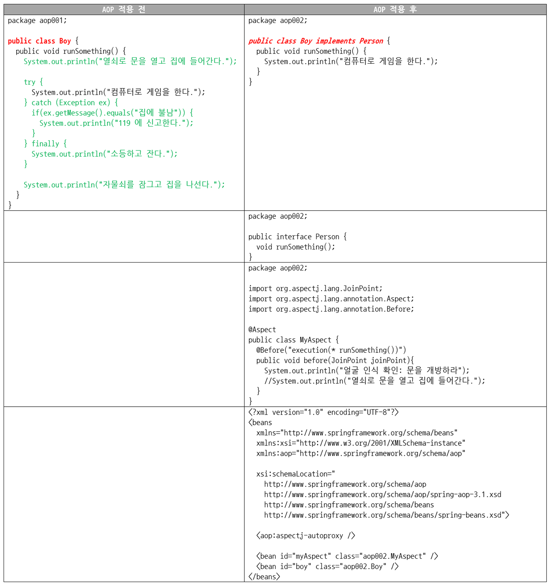

* 중요한 점 - `Boy.java`
  * 횡단 관심사(부수적인 관점)은 모두 사라지고 오직 핵심 관심사(핵심적인 관점)만 남았다.
  * 비록, 자바 파일은 더 많아졌지만, 추가 개발과 유지보수 관점에서 무척이나 편한 코드가 되었다.

* AOP를 통해 런타임에 로직 주입
  * 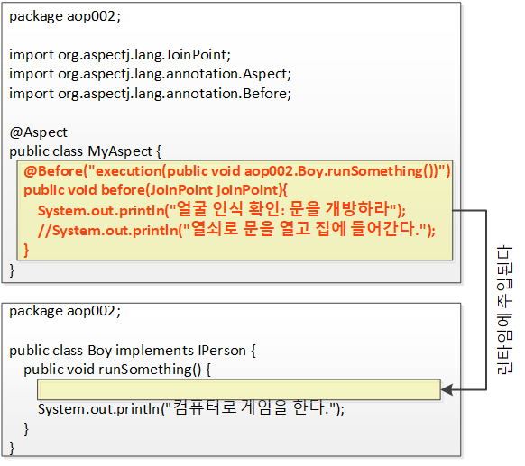
  * `@Before`로 만들어진 `before`메서드가 런타임에 위와 같이 주입된다.
  * ***프락시/데코레이터 패턴을 사용하는 것을 볼 수 있다.***
* AOP를 통해 런타임에 로직 주입 (상세)
  * 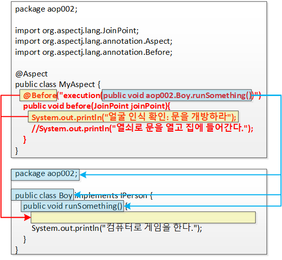
* 만약 `@Before("execution(* runSomething())")`로 변경한다면?
  * 모든 `runSomething()`메서드를 강제 구현시키는 `Person`인터페이스를 구현한 객체에서 실행된다.
  * `Girl.java`의 `runSomething()`메서드도 `@Before`를 통해 같은 로직을 주입해 줄 수 있다.


### 2-3. AOP는 프록시 패턴을 이용한다.

> 아래는 `Boy`와 `Girl` 예제에 AOP를 적용한 것이다.

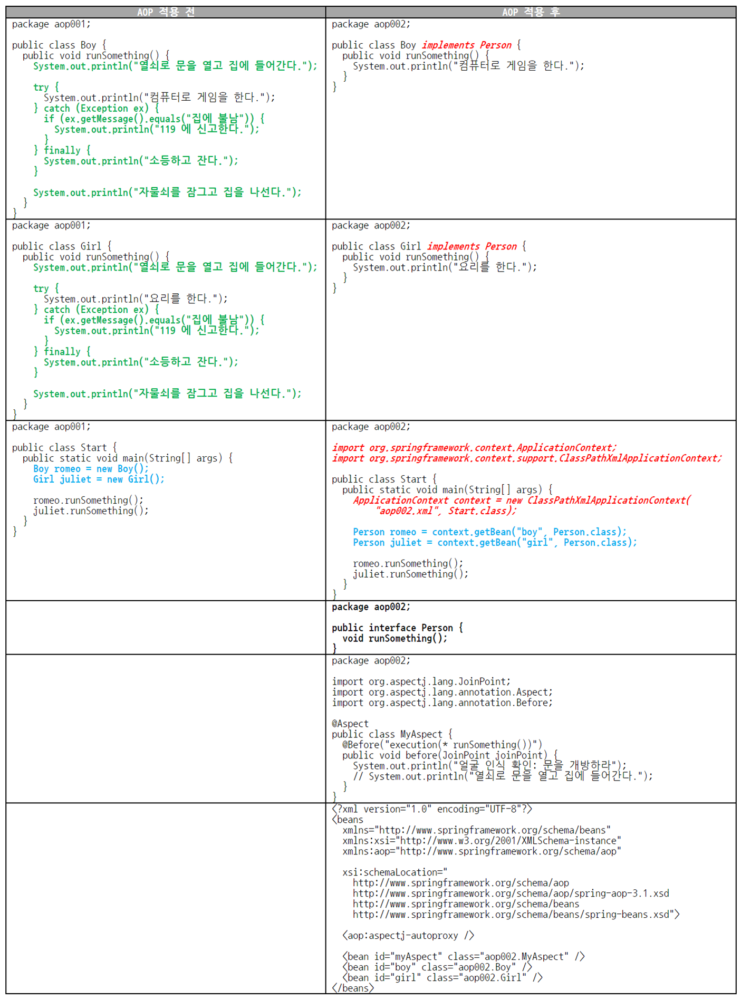

* 해석
  * 초록색 부분 : 횡단 관심사(부수적인 관점)이기 때문에 사라지는 것이다.
  * 붉은색 부분 : 스프링 AOP가 인터페이스 기반으로 작동하기 때문에 그 요건을 충족하기 위해서다.
* ***AOP는 인터페이스 기반이다.***
  
  * `Person`인터페이스를 이용하여 AOP를 적용시킬 객체들을 구현시킨다.
* `MyAspect.java` : 횡단 관심사(부수적인 관점)
  * `Boy`와 `Girl`에서 공통적으로 나타나는 횡단 관심사를 모두 삭제했지만 결국 누군가는 횡단 관심사를 처리해야 한다.
  * `MyAspect`가 바로 횡단 관심사를 처리하게 된다.
* `bean`
  * 빈이 설정되는 이유는 객체의 생성과 의존성 주입을 스프링 프레임워크에 위임하기 위해서다.
  * 스프링 프레임워크는 객체 생성뿐 아니라 객체의 생명주기 전반에 걸쳐 빈의 생성과 소멸까지 관리한다.
* `<aop:aspectj-autoproxy />` 
  
* 스프링에게 AOP프록시를 사용하라고 알려주는 지시자이다.
  
* 프록시 없이 직접 호출

  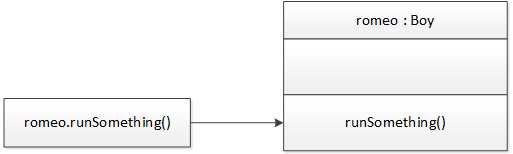

* 프록시 패턴(AOP)를 이용한 경우

  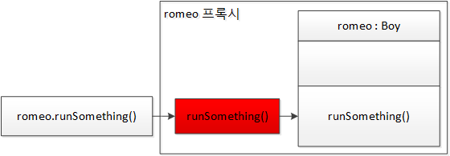

  * 호출하는 쪽에서 `romeo.runSomethong()`을 호출하면 프록시가 그 요청을 받아 진짜 `romeo`객체에게 요청을 전달한다.
  * `romeo`프록시는 `runSomething()`을 그냥 전달만 하지 않고 중간에 로직을 추가하거나 수정할 수 있다.(데코레이터)


> * 스프링 AOP는 프록시패턴을 사용한다.
>   * 개발자는 알지 못하지만 설정만 해주면, 스프링의 AOP컨테이너가 알아서 로직을 주입해준다.
> * 프록시 패턴
>   * 버퍼도 일종의 프록시라 볼 수 있다.
>   * ***존재 목적은 다르지만 하는 역할은 모두 중간에서 가로채는 것이라는 동일한 일을 한다.***


## 3. AOP용어

AOP에는 5가지의 용어가 존재한다.

- Aspect : 관점, 측면, 양상
  - 흩어진 관심사를 모듈화 한 것. 주로 부가기능을 모듈화함.

- Target
  - Aspect를 적용하는 곳 (클래스, 메서드)
- Advice : 조언, 충고
  - 실질적으로 어떤 일을 해야할 지에 대한 것, 실질적인 부가기능을 담은 구현체 (`myAspect`)
- JoinPoint : 결합점
  - Advice가 적용 될 위치, 끼어들 수 있는 지점. 
- PointCut : 자르는 점
  - JoinPoint의 상세한 스펙을 정의한 것.
  - `A란 메서드의 진입 시점에 호출할 것`과 같이 더욱 구체적으로 Advice가 실행될 지점을 정할 수 있다.


### 3-1. PointCut

```java
@Aspect
public class MyAspect {
  @Before("execution(* runSomething())") // PointCut
  public void before(JoinPoint joinPoint){
    System.out.println("얼굴 인식 확인 : 문을 개방하라");
  }
}
```

* PointCut이란?
  * 어디에 적용해야하는지?
  * 자르는 지점? ***Aspect 적용 위치 지정자***
  * `(* runSomething())`부분이 바로 PointCut이다.
  * PointCut은 횡당 관심사(부수적인 관점)를 적용할 타깃 메서드를 선택하는 지시자(메서드 선택 필어)인 것이다.
  * ***타깃 클래스의 타킷 메서드 지정자***


### 3-2. JoinPoint

* JoinPoint란?
  * 합류점. 메서드가 실행될 때의 시점. (메타정보)
  * 광의
    * PointCut은 JoinPoint의 부분 집합이다.
    * ***PointCut의 후보가 되는 모든 메서드들이 JoinPoint이다.*** 즉, Aspect 적용이 가능한 지점이 된다.
    * ***JoinPoint = Aspect 적용이 가능한 모든 지점.***
    * ***스프링 AOP에서 JoinPoint란 스프링 프레임워크가 관리하는 빈의 모든 메서드에 해당한다.***
  * 협의
    * JoinPoint란 호출된 객체의 메서드다.
    * JoinPoint는 그때 그때 다르다.
    * ***`romeo.runSomething()`메서드를 호출한 상태라면 JoinPoint는 `remeo`객체의 `runSomething()`메서드가 된다.***
    * ***`juliet.runSomething()`메서드를 호출한 상태라면 JoinPoint는 `juliet`객체의 `runSomething()`메서드가 된다.***
* JoinPoint 파라미터를 이용하면 실행 시점에 실제 호출된 메서드가 무엇인지, 실제 호출된 메서드를 소유한 객체가 무엇인지, 또 호출된 메서드의 파라미터는 무엇인지 등의 정보를 확인할 수 있다.


> 스프링 AOP는 인터페이스 기반이며, 인터페이스는 추상 메서드의 집합체다.
>
> 그러므로, 스프링 AOP는 메서드에만 적용 가능하다. (메서드 주입)


### 3-3. Advice

* Advice란?
  * 조언? 언제 무엇을!
  * Advice는 PointCut에 적용할 로직, 즉 메서드를 의미하는데, 여기에 더해 언제라는 개념까지 포함하고 있다.
  * ***Advice란 PointCut에 언제, 무엇을 적용할지 정의한 메서드다.***
  * ***`MyAspect`라고 생각하면 된다.***


### 3-4. Aspect

* Aspect란?
  * AOP에서 Aspect는 여러 개의 Advice와 여러 개의 PointCut의 결합체를 의미하는 용어다.
  * ***Aspect = Advice + PointCut***
    * ***Advice는 언제(when), 무엇을(what)을 의미한다.***
    * ***PointCut은 어디에(where)를 의미한다.***
  * ***결국 Aspect = When + Where + What이다.***


### 3-5. Advisor

* Advisor란?
  * Advisor = 한 개의 Advise + 한 개의 PointCut


## 4. 프록시 예시


### 4-1. 카드


* 해석
  * 카드는 현금의 프록시이다.
  * 카드와 현금은 결제 수단이라는 같은 인터페이스를 구현하고 있다. (`Payment`) 
  * 그러므로, 카드와 현금은 모두 결제 수단을 사용이 가능하다.
  * 이제 사용자는 카드만을 가지고 다니면 되므로 매우 편리하다. 

```java
public interface Payment{
  void pay(int amount);
}

public class Store {
  Payment payment;
  
  public Store(Payment payment) {
    this.payment = payment;
  }
  
  public void buySomething() {
    payment.pay(100);
  }
}

// Target
public class Cash implements Payment{
  @Override
  public void pay(int amount){
    System.out.println(amount + " 현금 결제");
  }
}

// 프록시 ( Aspect )
public class CreditCard implements Payment {
  
  Payment payment = new Cash();
  
  @Override
  public void pay(int amount){
    // 프록시에 로직을 넣을 수 있다!!
    if(amount > 100)
	    System.out.println(amout + " 신용 카드");
    else
    	cash.pay(amount); // 현금 결제
  }
}

public class Client {
  public static void main(String[] args){
    Payment payment = new CreditCard();
    payment.pay(100); // 카드 결제
    payment.pay(50); // 현금 결제
  }
}
```

* 여기서 중요한 점
  * 바로 `CreditCard`라는 프록시 객체의 `pay`안에 로직을 넣어줬다는 것이다.


### 4-2. 메서드의 성능 측정

> 두 개의 메서드가 실행될 때 마다 해당 메서드의 성능 측정을 하는 AOP를 구현하는 예제


* Target 설정
  * 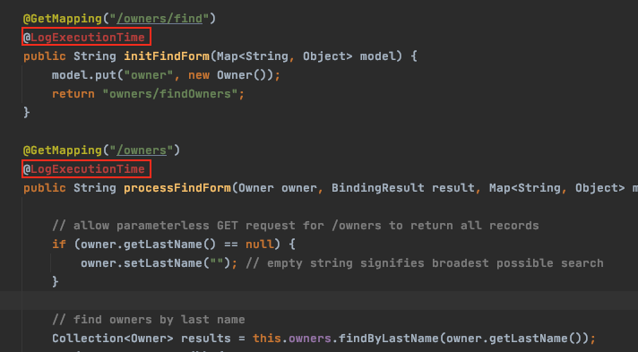
  * 성능 측정을 하고 싶은 메서드에 에노테이션을 붙여준다.
* 마커용 에노테이션을 만들어준다.
  * 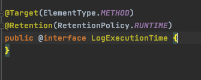
* Aspect를 생성해준다.
  * 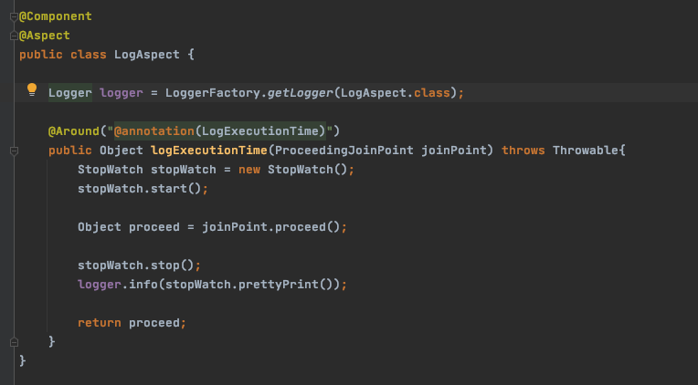
  * Bean으로 등록해줘야 한다.
  * 이제 `target` 들이 실행될 때마다 성능 측정이 된다.


</br>
</br>


</br>
</br>


# IoC/DI

스프링의 핵심 개념인 IoC와 DI에 대해서 다뤄보고자 한다.

> https://martinfowler.com/articles/injection.html


## 1. 의존성

스프링과 자바에서 빼놓을 수 없는 개념중 하나는 "의존성"이다.

이번 챕터에서는 의존성의 개념을 다룬다.


### 1-1. 프로그래밍에서 의존성이란?

```java
class Car {
  Tire tire;
  
  public Car() {
    tire = new Tire(); // Car 객체 생성자에서 new Tire()
  }
}

class Driver {
  public static void main(String[] args){
    Car car = new Car(); // Driver객체에서 Car 객체 생성
  }
}
```

* 해석
  * `Car`는 `Tire`에 의존한다.
  * `Driver`는 `Car`에 의존한다.
* 의존성이란?
  * 전체가 부분에 의존한다고 표현할 수 있다.
  * 의존하는 객체를 전체, 의존되는 객체를 부분이라 볼 수 있다.
  * 전체가 부분에 의존한다는 것과 "프로그래밍"에서 의존 관계는 new로 표현된다

 

> 의존하는 객체(전체)와 의존되는 객체(부분) 사이에 집합 관계와 구성 관계로 구분할 수 있다.
>
> * 집합 관계 : 부분이 전체와 다른 생명 주기를 가질 수 있다.
>   * 집 vs 냉장고
> * 구성 관계 : 부분은 전체와 같은 생명 주기를 갖는다.
>   * 사람 vs 심장


### 1-2. 일반적인 의존관계 생성

```java
interface Tire {
  String getBrands();
}

public class KoreaTire implements Tire {
  public String getBrands() {
    return "코리아 타이어";
  }
}

public class AmericaTire implements Tire {
  public String getBrands() {
    return "미국 타이어";
  }
}

public class Car {
  Tire tire;
  
  public Car() {
    // 의존 관계가 일어나는 부분
    tire = new KoreaTire();
    // tire = new AmericaTire();
  }
  
  public String getTireBrand() {
    return "장착된 타이어 : "+tire.getBrands();
  }
}

public class Driver {
  public static void main(String[] args){
    Car car = new Car();
    System.out.println(car.getTireBrand());
  }
}
```

* 해석
  * 자동차는 타이어에 의존한다. (`Car`객체는 `KoreaTire`객체에 의존한다.)
  * 운전자는 자동차를 사용한다.
  * 운전자가 자동차에 의존한다고 봐도 된다.
  * 자동차의 생성자 코드에서 `tire`속성에 새로운 타이어를 생성해서 참조할 수 있게 해주었다.


### 1-3. 전략 패턴

의존성과 관련해서는 "전략 패턴"을 떠올릴 수 있다.

* 전략 패턴의 3요소
  * 전략 메서드를 가진 전략 객체
  * 전략 객체를 사용하는 컨텍스트
  * 전략 객체를 생성해 컨텍스트에 주입하는 클라이언트(제3자)
* 의존성에서의 3요소
  * 전략 : `Tire`를 구현한 `KoreaTire`, `AmericaTire`
  * 컨텍스트 : `Car`의 `getTireBreand()`메서드
  * 클라이언트 : `Driver`의 `main()`메서드


### 1-4. 의존성 역전의 의미

```java
// 일반적인 경우
class OwnerController {
  private OwnerRepository repository = new OwnerRepository();
}

// IoC
class OwnerController {
  private OwnerRepository repo;
  
  public OwnerController(OwnerRepository repo){
    this.repo = repo;
  }
}
```

* 일반적인 경우 : 자기가 사용할 의존성을 자기가 만들어서 사용한다. (의존성에 대한 제어권을 자기 자신이 가지고 있다.)
* IoC (제어권 역전) : ***의존성에 대한 제어권을 자기 자신이 아닌 외부에서 주입해준다.***
  * 의존성을 생성(new)하는 일을 더이상 자기 자신이 하지 않는다. (외부에 맡긴다.)


## 2. 스프링 없이 의존성 주입하기

> 주입이란?
>
> * 주입이란 말은 ***외부에서라는 뜻***을 내포하고 있는 단어다.
> * 결국 ***자동차 내부에서 타이어를 생산하는 것이 아니라 외부에서 생산된 타이어를 자동차에 장착하는 작업이 주입이다.***


### 2-1. 생성자를 통한 의존성 주입

```java
interface Tire {
  String getBrands();
}

public class KoreaTire implements Tire {
  public String getBrands() {
    return "코리아 타이어";
  }
}

public class AmericaTire implements Tire {
  public String getBrands() {
    return "미국 타이어";
  }
}

public class Car {
  Tire tire;
  
  // 변경된 부분
  public Car(Tire tire) {
    // 생성자의 매개변수를 통해 의존성 주입
    this.tire = tire;
  }
  
  public String getTireBrand() {
    return "장착된 타이어 : "+tire.getBrands();
  }
}

public class Driver {
  public static void main(String[] args){
    Car car = new Car();
    System.out.println(car.getTireBrand());
  }
}
```

* 해석

  * 운전자가 타이어를 생산한다. (`Driver`객체는 `Tire`객체에 의존적이다.)
  * 운전자가 자동차를 생산하면서 타이어를 장착한다. (생성자를 통한 의존성 주입)

* 의존성 주입

  * ```java
    Tire tire = new KoreaTire();
    Car car = new Car(tire); // 생성자를 통한 의존성 주입.
    ```

* 현실 세계 비유

  * 자동차가 생산될 때 어떤 타이어를 생산해서 장착할까를 자동차가 스스로 고민하지 않고, 운전자가 차량을 생산할 때 운전자가 어떤 타이어를 장착할까를 고민하게 하는 것이다.
  * 자동차는 어떤 타이어를 장착할까를 더는 고민하지 않아도 된다.

* 장점

  * 기존엔 타이어의 종류를 선택하지 못했지만, 의존성 주입을 통해 타이어를 운전자가 선택해서 의존관계를 생성할 수 있다. 
  * 확장성이 좋아진다. 새로운 타이어가 만들어져도 언제든 의존성을 주입할 수 있다.
    * 인터페이스, 다형성


> 현실 세계에서의 인터페이스
>
> * 의미
>   * 현실 세계에서는 인터페이스라는 말보다 ***표준화***했다는 말이 더 와 닿는다.
> * 예제
>   * 페트병의 병마개.
>   * 어떤 음료수 페트병이든 같은 표준화된 규격에 맞게 생산된다.


### 2-2. 속성을 통한 의존성 주입

```java
interface Tire {
  String getBrands();
}

public class KoreaTire implements Tire {
  public String getBrands() {
    return "코리아 타이어";
  }
}

public class AmericaTire implements Tire {
  public String getBrands() {
    return "미국 타이어";
  }
}

public class Car {
  Tire tire;
  
  // 변경된 부분
  public Tire getTire() {
    return tire;
  }
  
  // setter를 사용한 의존성 주입
  public void setTire(Tire tire) {
    this.tire = tire;
  }
  
  public String getTireBrand() {
    return "장착된 타이어 : "+tire.getBrands();
  }
}

public class Driver {
  public static void main(String[] args){
    Tire tire = new KoreaTire();
    Car car = new Car();
    car.setTire(tire); // setter를 사용한 의존성 주입.
    System.out.println(car.getTireBrand());
  }
}
```

* 해석

  * 운전자가 타이어를 생산한다.
  * 운전자가 자동차를 생산한다.
  * 운전자가 자동차에 타이어를 장착한다.

* 의존성 주입

  * ```java
    Tire tire = new KoreaTire();
    Car car = new Car();
    car.setTire(tire); // setter를 사용한 의존성 주입.
    ```

* 현실 세계 비유

  * 자동차를 생산(구입)할 때 한번 타이어를 장착하면 더 이상 타이어를 교체 장착할 방법이 없다는 문제가 생긴다.
  * 더 현실적인 방법은 운전자가 원할 때 `Car`의 `Tire`를 교체하는 것이다. 자바에서 이를 구현하려면 생성자가 아닌 속성을 통한 의존성 주입이 필요하다.

* 장점
  
  * 자동차의 `Tire`를 언제든 교체할 수 있다.


> ***한번 더 생각해볼 내용***
>
> * `Car`가 변경됐기에 이를 사용하는 `Driver`도 바뀌었다. 이를 `Driver`가 `Car`에 의존적이라는 얘기이다.


## 3. 스프링을 통한 의존성 주입

스프링을 통해서 의존성을 주입해보자.

* `@Autowired`
  * 생성자 (스프링 5.0부터는 생성자를 통한 의존성 주입을 권장한다.)
    * 객체는 꼭 생성자라는 단계를 거치고 생성되므로, ***의존성 주입을 강제***하므로 권장한다고 한다.
  * 필드
  * Setter


### 3-1. XML 파일을 통한 의존성 주입

```xml
<?xml version="1.0" encoding="UTF-8"?>
<beans xmlns="http://www.springframework.org/schema/beans"
       xmlns:xsi="http://www.w3.org/2001/XMLSchema-instance"
       xsi:schemaLocation="http://www.springframework.org/schema/beans
                           http://www.springframework.org/schema/beans/spring-beans.xsd">
  
  <bean id="tire" class="expert002.KoreaTire"></bean>
  <bean id="americaTire" class="expert002.AmericaTire"></bean>
  <bean id="car" class="expert002.Car"></bean>
</beans>
```

* 해석
  * ***XML파일을 종합 쇼핑몰이라고 생각하면 이해가 쉽다. (타이어를 구매할 수 있는 쇼핑몰)***
  * XML파일에 `<bean>`을 이용해서 타이어의 목록을 작성해준다.
  * ***종합 쇼핑몰의 역할을 하는 것이 바로 스프링 프레임워크다.***
* 참고
  * **기존의 `Car`, `KoreaTire`, `AmericaTire` 클래스 파일을 `expert002` 패키지에 넣어두었다. **


```java
import org.springframework.context.ApplicationContext;
import org.springframework.context.support.ClassPathXmlApplicationContext;

public class Driver {
  ApplicationContext context = new ClassPathXmlApplicationContex("expert002/expert002.xml");
  
  Car car = context.getBean("car", Car.class);
  
  Tire tire = context.getBean("tire", Tire.class);
  
  car.setTire(tire);
  
  System.out.println(car.getTireBrands());
}
```

* 해석
  * 운전자가 종합 쇼핑몰(XML)에서 타이어를 구매한다.
  * 운전자가 종합 쇼핑몰(XML)에서 자동차를 구매한다.
  * 운전자가 자동차에 타이어를 장착한다. (의존성 주입)

* 의존성 주입

  * ```java
    // xml(종합 쇼핑몰) 불러오기.
    ApplicationContext context = new ClassPathXmlApplicationContex("expert002/expert002.xml");
    
    Car car = context.getBean("car", Car.class); // 종합 쇼핑몰에서 자동차 구매
    
    Tire tire = context.getBean("tire", Tire.class); // 종합 쇼핑몰에서 타이어 구매
    
    car.setTire(tire); // 속성을 이용한 자동차에 타이어 장착 (의존성 주입)
    ```

  * 스프링을 도입한다고 해서 기존 방식과 달라질 것은 없다. 오직 `Driver`클래스만 살짝 손봐주고 스프링 설정 파일(xml) 하나만 추가하면 된다.

* 현실 세계 비유

  * 종합 쇼핑몰이 하나 들어온 것 외에는 달라진 부분이 없다.
  * 운전자가 타이어, 자동차를 직접 생산하던 시스템에서 종합 쇼핑몰을 통해 구매하는 형태로 바뀌었다.

* 종합 쇼핑몰 (xml)

  * 아무리 종합 쇼핑몰이라고 해도 상품이 입점돼 있어야만 판매할 수 있다.
  * 입점된 상품에 대한 정보는 바로 xml파일에 저장하며 해당 xml파일의 위치는 아래와 같다.
  * `/src/main/java/expert002/expert002.xml`

* 장점 (스프링을 도입하는 얻는 이득)
  * ***자동차의 타이어 브랜드를 변경할 때 그 무엇도 재컴파일/재배포하지 않아도 XML파일만 수정하면 프로그램의 실행 결과를 바꿀 수 있다.***
  * `Driver.java`의 `Tire tire = context.getBean("tire", Tire.class)`
    * 이 부분이 타이어를 구매하는 부분인데, 자바 코드 어디에서도 `KoreaTire`클래스나 `AmericaTire`클래스를 지칭하는 부분이 없다. 바로 `xml`파일에 있기 때문이다.
    * `AmericaTire`로 타이어를 바꿔야 하더라도 자바 코드를 변경/재컴파일/재배포할 필요가 없다.

* 전체적인 그림
  * 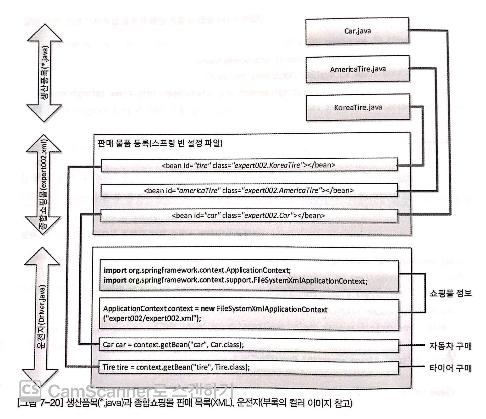
  * `KoreaTire.java`가 XML파일에서 `id=tire`인 bean 태그와 연결돼 있고, 다시 `Driver.java`의 `main()`메서드 안의 코드인 `context.getBean("tire", Tire.class)`와 연결돼 있는 것을 볼 수 있다.
  * `KoreaTire`라고 하는 상품이 `tire`라는 이름으로 진열돼 있고, 구매(`getBean`)할 수 있다.


> `spring bean`이란?
>
> * ***간단하게 말하면 자바 객체이다.***
>   * 스프링 컨테이너에 의해서 자바 객체가 만들어 지게 되면 이 객체를 스프링은 스프링 빈이라고 부른다.
>   * 스프링 빈과 자바 일반 객체와의 차이점은 없다. 다만 스프링 컨테이너에서 만들어질 뿐이다.
> * 레퍼런스
>   * 스프링 IoC컨테이너에 의해서 관리되고 애플리케이션의 핵심을 이루는 객체들을 스프링에서는 빈즈(beans)라고 부른다.
>   * 빈은 스프링 IoC컨테이너에 의해서 인스턴스화되어 조립되거나 관리되는 객체를 말한다.
>   * 이같은 점을 제외하고 빈은 수많은 객체들중의 하나일 뿐이다.
>   * 빈과 빈 사이의 의존성은 컨테이너가 사용하는 메타데이터 환경설정에 반영된다.


### 3-2. 스프링 설정 파일(xml)에서 속성 주입

```xml
<?xml version="1.0" encoding="UTF-8"?>
<beans xmlns="http://www.springframework.org/schema/beans"
       xmlns:xsi="http://www.w3.org/2001/XMLSchema-instance"
       xsi:schemaLocation="http://www.springframework.org/schema/beans
                           http://www.springframework.org/schema/beans/spring-beans.xsd">
  
  <bean id="koreaTire" class="expert002.KoreaTire"></bean>
  <bean id="americaTire" class="expert002.AmericaTire"></bean>
  <bean id="car" class="expert002.Car">
    <property name="tire" ref="koreaTire"></property>
  </bean>
</beans>
```

* 변경된 점
  * XML 파일에 새롭게 `<property>`부분이 추가되었다. 
  * ***자바에서 접근자 및 설정자(Getter/Setter)메서드를 속성 메서드라고 하는데 영어로 속성은 `property`이다.***
  * ***`Driver.java`에서 `car.setTire(tire)`를 xml파일의 `<property>`가 대신하는 것.***


```java
import org.springframework.context.ApplicationContext;
import org.springframework.context.support.ClassPathXmlApplicationContext;

public class Driver {
  ApplicationContext context = new ClassPathXmlApplicationContex("expert002/expert002.xml");
  
  Car car = context.getBean("car", Car.class);
  
  System.out.println(car.getTireBrands());
}
```

* 해석

  * 운전자가 종합 쇼핑몰에서 자동차를 구매 요청한다.
  * 종합 쇼핑몰은 자동차를 생산한다.
  * 종합 쇼핑몰은 타이어을 생산한다.
  * 종합 쇼핑몰은 자동차에 타이어를 장착한다. (`<property>`)
  * 종합 쇼핑몰은 운전자에게 자동차를 전달한다.

* 의존성 주입

  * ```xml
    <bean id="car" class="expert002.Car">
      <property name="tire" ref="koreaTire"></property>
    </bean>
    ```

  * xml파일은 사용해서 `Car`객체 안에 `koreaTire`객체 의존성을 주입하였다.

* 전체적인 그림
  * 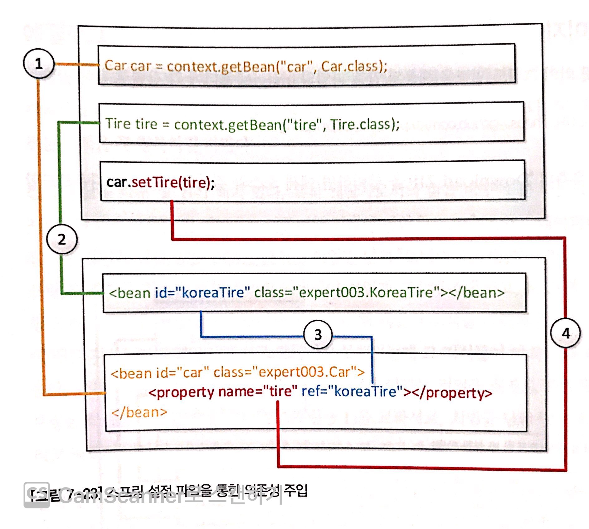
  * `Driver`가 자동차와 타이어를 구매(`getBean`)하고 직접 장착한것과 달리 xml(종합쇼핑몰)을 사용해서 타이어를 장착한 상태로 자동차를 구매할 수 있게 하였다.


### 3-3. @Autowired를 통한 속성 주입

기존엔 `getter/setter`를 통해서 속성 주입을 해왔다.

스프링 개발자들은 "창조적 게으름"을 발해휘 `@Autowired`를 통한 속성 주입을 고안해냈다.

```xml
<?xml version="1.0" encoding="UTF-8"?>
<beans xmlns="http://www.springframework.org/schema/beans"
       xmlns:xsi="http://www.w3.org/2001/XMLSchema-instance"
       xmlns:context="http://www.springframework.org/schema/context"
       xsi:schemaLocation="http://www.springframework.org/schema/beans
                           http://www.springframework.org/schema/beans/spring-beans.xsd
                           http://www.springframework.org/schema/context
                           http://www.springframework.org/schema/context/spring-context-3.1.xsd">
  
  <context:annotation-config />
  <bean id="tire" class="expert002.KoreaTire"></bean>
  <bean id="americaTire" class="expert002.AmericaTire"></bean>
  <bean id="car" class="expert002.Car"></bean>
</beans>
```

* 변경된 점
  * `context`라는 `<namespace>`를 불러오고, `<context:annotation-config />`가 추가되었다.
* `@Autowired`의 의미
  * ***`@Autowired`의 의미를 스프링 설정 파일을 보고 자동으로 속성의 설정자 메서드에 해당하는 역할을 해주겠다는 의미이다.***
  * `<property>` 태그가 사라진 이유는 `@Autowired`를 통해 `car`의 `property`를 자동으로 엮어줄 수 있으므로 생략이 가능해진 것이다. (자동 의존성 주입)

```java
// Car 클래스의 달라진 점
public class Car {
  @Autowired
  Tire tire;
  
  public String getTireBrands(){
    return "장착된 타이어 : "+tire.getBrands();
  }
}
```

* 해석
  * 운전자가 종합 쇼핑몰에서 자동차를 구매 요청한다.
  * 종합 쇼핑몰은 자동차를 생산한다.
  * 종합 쇼핑몰은 타이어를 생산한다.
  * 종합 쇼핑몰은 자동차에 타이어를 장착한다.
  * 종합 쇼핑몰은 운전자에게 자동차를 전달한다.

* 의존성 주입

  * ```java
    // 기존의 코드
    Tire tire;
    public void setTire(Tire tire){
      this.tire = tire;
    }
    
    // @Autowired를 통한 속성 주입
    @Autowired
    Tire tire;
    ```

* 전체적인 그림

  * 
  * `@Autowired`애노테이션을 이용하면 설정자 메서드를 이용하지 않고도 종합 쇼핑몰인 스프링 프레임워크가 설정 파일을 통해 설정자 메서드 대신 속성을 주입해준다.


> 번외 1 : `AmericaTire`로 변경된 `Driver.java`를 실행하려면 어디를 고쳐야할까?

```xml
<bean id="tire02" class="expert002.KoreaTire"></bean>
<bean id="tire" class="expert002.AmericaTire"></bean>
```

* 재컴파일할 필요 없이 xml에서 `bean`의 `id`속성만 변경하면 된다.


> 번외 2 : `KoreaTire` 부분을 삭제하고, `AmericaTire`의 `id`속성을 삭제해보자.

```xml
<?xml version="1.0" encoding="UTF-8"?>
<beans ...>
  
  <context:annotation-config />
  <bean class="expert002.AmericaTire"></bean>
  <bean id="car" class="expert002.Car"></bean>
</beans>
```

* 해석
  * `AmericaTire`를 `@Autowired`로 자동 의존성 주입을 한다.
  * 타이어 관련 `bean`을 보면 `id`가 없지만 결과는 잘 동작한다.
  * 그 이유는 `interface`구현 여부에 있다.

* `@Autowired`의 속성 매칭 규칙

  * 
  * `@Autowired`는 `type`을 먼저 체크하고 `id`를 체크한다.
  * ***`type`의 우선순위가 더 높다.***

* `@Autowired`의 예제

  * ```java
    // Car.java
    @Autowired Tire tire;
    
    // expert.xml
    <bean id="usaTire" class="expert004.AmericaTire"></bean>
    ```

    * `type`을 통해 정상적으로 의존성이 주입된다. 

  * ```java
    // Car.java
    @Autowired Tire tire;
    
    // expert.xml
    <bean class="expert004.AmericaTire"></bean>
    <bean class="expert004.KoreaTire"></bean>
    ```

    * 둘 다 똑같은 인터페이스 (`Tire`)를 구현하고 있으며 `id`가 없다. 이럴 경우 실행 시 에러가 발생한다.
    * `@Autowired`가 어떤 것에 매칭해줄지 모르기 때문이다.

  * ```java
    // Car.java
    @Autowired Tire tire;
    
    // expert.xml
    <bean id="tire" class="expert004.AmericaTire"></bean>
    <bean class="expert004.KoreaTire"></bean>
    ```

    * `AmericaTire`로 동작하게 된다.

  * ```java
    // Car.java
    @Autowired Tire tire;
    
    // expert.xml
    <bean id="wheel" class="expert004.AmericaTire"></bean>
    ```

    * `@Autowired`는 `id`보다 `type`이 먼저이기 때문에 정상적으로 구동된다.

  * ```java
    // Door.java
    public class Door {}
    
    // Car.java
    @Autowired Tire tire;
    
    // expert.xml
    <bean class="expert004.KoreaTire"></bean>
    <bean id="tire" class="expert004.Door"></bean>
    ```

    * `KoreaTire`로 매칭된다.


### 3-4. @Resource를 통한 속성 주입

```xml
<?xml version="1.0" encoding="UTF-8"?>
<beans xmlns="http://www.springframework.org/schema/beans"
       xmlns:xsi="http://www.w3.org/2001/XMLSchema-instance"
       xmlns:context="http://www.springframework.org/schema/context"
       xsi:schemaLocation="http://www.springframework.org/schema/beans
                           http://www.springframework.org/schema/beans/spring-beans.xsd
                           http://www.springframework.org/schema/context
                           http://www.springframework.org/schema/context/spring-context-3.1.xsd">
  
  <context:annotation-config />
  <bean id="tire" class="expert002.KoreaTire"></bean>
  <bean id="americaTire" class="expert002.AmericaTire"></bean>
  <bean id="car" class="expert002.Car"></bean>
</beans>
```

* 변경된 점
  * 없다.

```java
public class Car {
  @Resource
  Tire tire;
  
  public String getTireBrands(){
    return "장착된 타이어 : " + tire.getBrands();
  }
}
```

* 해석
  * 운전자가 종합 쇼핑몰에서 자동차를 구매 요청한다.
  * 종합 쇼핑몰은 자동차를 생산한다.
  * 종합 쇼핑몰은 타이어를 생산한다.
  * 종합 쇼핑몰은 자동차에 타이어를 장착한다.
  * 종합 쇼핑몰은 운전자에게 자동차를 전달한다.
* 의존성 주입
  * 기존의 `@Autowired`가 `@Resource`로 바뀐 것 뿐이다.
* `@Resource`의 속성 매칭 규칙
  * `type`보다 `id`의 우선순위가 더 높다.
  * `id`로 매칭을 찾지 못한 경우 `type`으로 매칭할 빈을 찾게된다.


### 3-5. @Autowired vs. @Resource vs. `<property>`

스프링에서 빈(객체)를 매칭할 수 있는 주요한 방법은 세 가지이다.

* @Autowired
* @Resource
* `<property>`


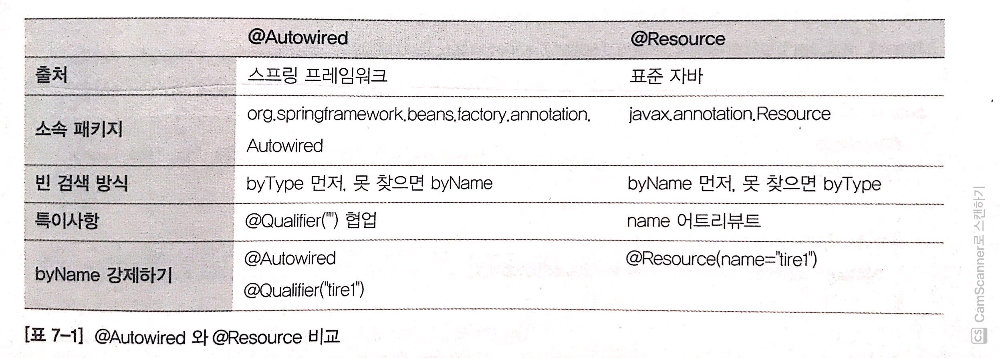

* 차이점
  * `@Autowired`는 스프링의 어노테이션이고, `@Resource`는 자바 표준 어노테이션이다.
  * `@Autowired`는 `type`이 `id`보다 우선순위가 더 높다.
  * `@Resource`는 `id`가 `type`보다 우선순위가 더 높다.


> 아래 부터는 사례 연구이며 xml파일만을 다루고 있다. 자바에서의 코드는 다음과 같다.

```java
public class Car {
  Tire tire;
  
  public String getBrands() {
    return "장착된 타이어 : " + tire.getBrands();
  }
}
```


> 사례 연구 1 : 한 개의 빈이 id 없이 tire 인터페이스를 구현한 경우

```xml
<?xml version="1.0" encoding="UTF-8"?>
<beans ...>
  <context:annotation-config />
  
	<bean class="expert006.koreaTire"></bean>
  
  <bean id="car" class="expert006.Car"></bean>
</beans>
```

* 두 경우 모두 아무 문제 없이 실행된다.


> 사례 연구 2 : 두 개의 빈이 id 없이 tire 인터페이스를 구현한 경우

```xml
<?xml version="1.0" encoding="UTF-8"?>
<beans ...>
  <context:annotation-config />
  
	<bean class="expert006.koreaTire"></bean>
  <bean class="expert006.AmericaTire"></bean>

  <bean id="car" class="expert006.Car"></bean>
</beans>
```

* 둘 다 오류가 난다. `KoreaTire`와 `AmericaTire` 모두 매칭이 되기 때문에 오류가 발생하는 것.


> 사례 연구 3 : 두 개의 빈이 tire 인터페이스를 구현하고 하나가 일치하는 id를 가진 경우

```xml
<?xml version="1.0" encoding="UTF-8"?>
<beans ...>
  <context:annotation-config />
  
	<bean id="tire" class="expert006.koreaTire"></bean>
  <bean id="tire2" class="expert006.AmericaTire"></bean>

  <bean id="car" class="expert006.Car"></bean>
</beans>
```

* `@Resource`
  * `KoreaTire`로 매칭되며 정상적으로 구동된다.
* `@Autowired`
  * `KoreaTire`로 매칭되며 정상적으로 구동된다.


> 사례 연구 4 : 두 개의 빈이 tire 인터페이스를 구현하고 일치하는 id가 없는 경우

```xml
<?xml version="1.0" encoding="UTF-8"?>
<beans ...>
  <context:annotation-config />
  
	<bean id="tire1" class="expert006.koreaTire"></bean>
  <bean id="tire2" class="expert006.AmericaTire"></bean>

  <bean id="car" class="expert006.Car"></bean>
</beans>
```

* `@Resource`
  * 두 개의 타이어 모두 매칭이 되므로 오류가 발생한다.
* `@Autowired`
  * 두 개의 타이어 모두 매칭이 되므로 오류가 발생한다.


> 사례 연구 5 : 일치하는 id가 하나 있지만 인터페이스를 구현하지 않은 경우

```xml
<?xml version="1.0" encoding="UTF-8"?>
<beans ...>
  <context:annotation-config />
  
	<bean id="tire" class="expert006.Door"></bean>

  <bean id="car" class="expert006.Car"></bean>
</beans>
```

* `@Resource`
  * 오류가 발생한다.
* `@Autowired`
  * 오류가 발생한다.


> 사례 연구 6 : `@Resource`어노테이션의 name 속성이 id와 일치하는 경우

```xml
<?xml version="1.0" encoding="UTF-8"?>
<beans ...>
  <context:annotation-config />
  
	<bean id="tire1" class="expert006.KoreaTire"></bean>
  <bean id="tire2" class="expert006.AmericaTire"></bean>

  <bean id="car" class="expert006.Car"></bean>
</beans>
```

```java
public class Car {
  @Resource(name="tire1")
  Tire tire;
  
  public String getTireBrands(){
    return "장착된 타이어 : " + tire.getBrands();
  }
}
```

* `KoreaTire`가 매칭되는 것을 볼 수 있다.
* `name`속성과 일치하는 `id`가 가장 우선순위가 높다.


> 사례 연구 7 : `@Autowired`의 속성 지정

```java
public class Car {
  @Autowired
  @Qualifier("tire1")
  Tire tire;
  
  public String getTireBrands(){
    return "장착된 타이어 : " + tire.getBrands();
  }
}
```

* `KoreaTire`가 매칭된다.


> 결론

* 결론
  * `@Resource`와 `@Autowired`를 사용하는데 크게 차이가 없다.
* 뭐가 더 좋은가?
  * `@Autowired`와 `@Resource`중에서는 `@Resource` 추천
  * `@Resource`와 `<property>`중에서는 `<property>` 추천


### 3-6. xml을 통한 의존성 주입의 결론

* 재컴파일과 재배포가 필요없다.
* ***설정 파일을 쓰는 가장 중요한 이유가 재컴파일/재배포 없이 프로그램의 실행 결과를 변경할 수 있기 때문이다.***
* DI는 외부에 있는 의존 대상을 주입하는 것을 말한다.


> ***의존관계의 재해석?***
>
> * 변수에 값을 할당하는 모든 곳에 의존 관계가 생긴다.
> * 즉 대입연산자에 의해 변수에 값이 할당되는 순간에 의존이 생긴다.


## 4. IoC 컨테이너

IoC컨테이너는 싱글톤패턴을 사용해서 의존성을 주입해준다.


### 4-1. IoC 컨테이너란

***BeanFactory (Application Context)***

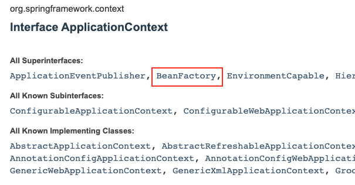

* IoC컨테이너란?
  * ***빈(bean)을 만들고 빈(bean)들 사이의 의존성을 엮어주며 제공해준다.***
* 빈 설정
  * 이름 또는 ID
  * 타입
  * 스코프
* 빈 설정 방법
  * 직접 등록
    * `@Bean`
    * `@Autowired`
  * 에노테이션
  * 특정 인터페이스 상속


> IoC를 통한 의존성 주입은 빈(bean)끼리만 가능하다.


### 4-2. IoC 컨테이너의 자동 의존성 주입

> 예제

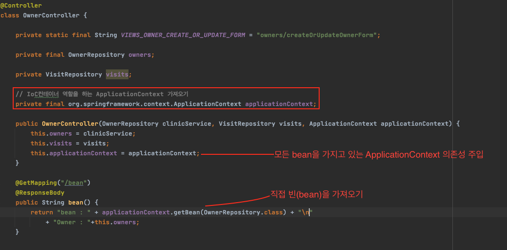

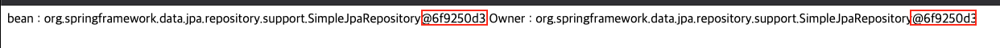

* 해석
  * 하나는 IoC 컨테이너를 통해 `OwnerRepository`객체를 자동으로 의존성 주입된 것이고 (자동)
  * 다른 하나는 직접  `ApplicationContext`를 의존성 주입받아 `OwnerRepository`빈(bean)의 의존성을 주입한 것이다. (수동)


## 5. Bean


### 5-1. Bean이란?

* Bean이란?
  * 스프링 IoC 컨테이너가 관리하는 객체
  * 스프링이 관리하는 `ApplicationContext`에서 해당 객체를 가져온 것이므로 bean이 맞다.
  * 즉, 스프링이 가지고 있는 객체를 `bean`이라고 한다.

```java
public void test{
  OwnerController ownerController = new OwnerController(); // bean이 아님
  
  OwnerController bean = applicationContext.getBean(OwnerController.class); // bean
}
```


### 5-2. Bean 등록 방법

* Component Scanning

  * IoC컨테이너가 시작할 때 `@Component`어노테이션을 상속받은 모든 어노테이션들을 Bean에 등록해준다.
  * `@Component`
    * `@Repository`
    * `@Service`
    * `@Controller`
    * `@Configuration`
    * 직접 정의 가능.

* 직접 일일히 XML이나 자바 설정 파일에 등록.

  * 자바 설정 클래스 (`@Confoguration`을 이용하면 된다.)

  * ```java
    @Configuration // IoC가 자동적으로 @Configuration객체를 빈으로 저장한다.
    public class SampleConfig {
      
      @Bean // @Configuration 빈 안에 위치한 사용자 정의 Bean
      public SampleController sampleController() {
        return new SampleController();
      }
    }
    ```


## 6. 코드로 보는 IoC/DI

> 백기선님의 강의 내용과 예시를 토대로 만듬.


### 6-1. 생성자를 통한 의존성 주입

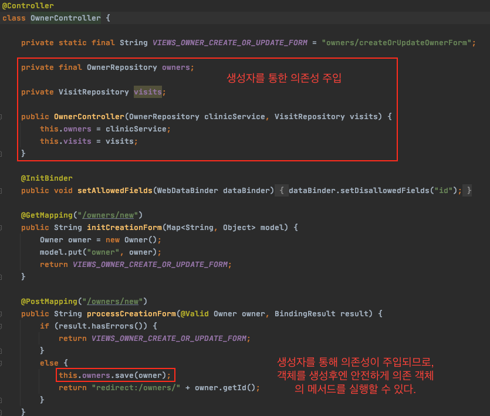

* 해석
  * ***생성자를 통한 의존성 주입***
  * 생성자를 통해 의존성이 주입되므로, 객체를 생성후엔 무조건 생성자가 실행을 통해 의존성이 주입되므로, 의존 객체의 메서드를 안전하게 실행할 수 있다.
* ***누가 `OwnerController`를 인스턴스화 시키는가?***
  * 누군가가 `OwnerController`를 인스턴스화해줘야 의존성이 주입도 되고 사용도 가능해진다. 그럼 누가 해주는 것인가?
  * ***바로 스프링 IoC컨테이너가 해주는 것이다. 스프링이 Bean(스프링에서의 자바 객체)을 통해 의존성을 주입해준다.***


> ***어떤 종류의 객체를 bean으로 만드는가?***
>
> * 스프링을 사용해서 의존성 관리를 하고 싶은 객체는 빈으로 만들어쓰고 그렇지 않은 객체는 빈으로 등록하지 않는다.


